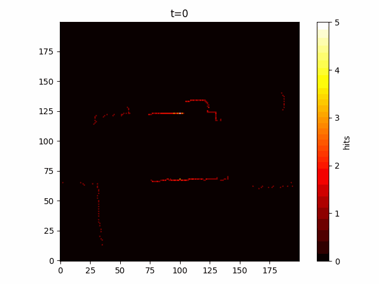
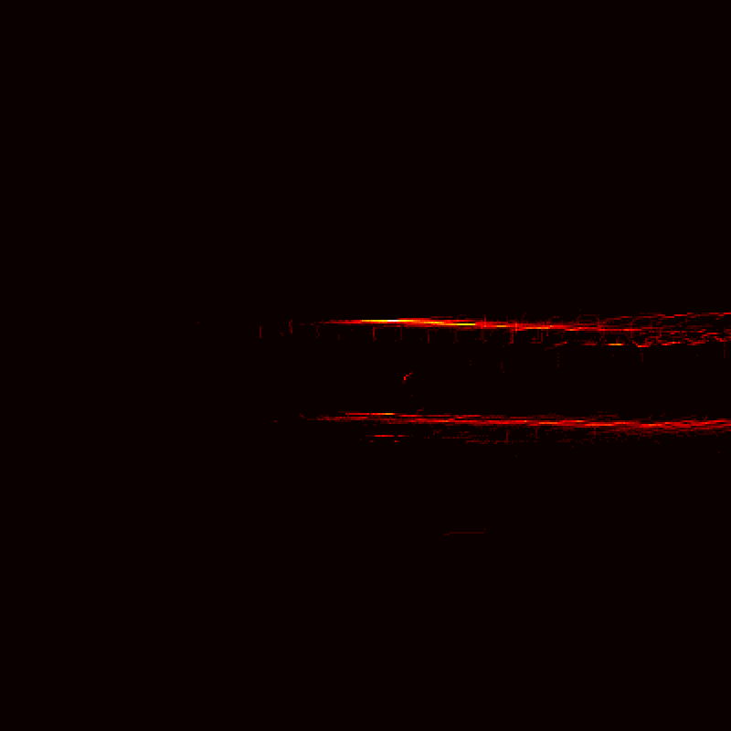

# Indoor Navigation Machine Learning

File Outline
=============

- Testing: test scripts
- Outputs: LiDAR data recording
- Include: non-programmed files
- src: classes written for the project to call from

Anything in the main directory is a canidate for the final code testing file, eventually to be called main.py

Pipfile
===========
To run scripts this project uses Pipfile for dependency management. 

On Windows
-----------
For windows make sure to install pipenv, then once it's installed to run commands write:

`py -m pipenv run <command>`

On Linux
-----------
Pipfile functions differently on linux since it's already on the path once you install pipenv

`pipenv run <command>`

Commands
---------

| Command    | File                               |
| :--------- | :--------------------------------- |
| main       | src/main.py                        |
| lidar      | testing/LiDAR.py                   |
| mapping    | testing/LiDAR-mapping.py           |
| odo        | testing/odometry-test.py           |
| map        | testing/map.py                     |
| gps        | testing/gps_test.py                |
| aio        | testing/asyncio-test.py            |
| r2d2       | testing/R2D2-LiDAR.py              |
| matplot    | testing/lidar-matplot.py           |
| rssi       | src/live_rssi.py                   |
| main_rssi  | src/main_RSSI.py                   |
| gif        | testing/image-to-gif.py            |

Progress
=========
Since this is pseudo SLAM from scratch without ROS, learning all of the elements that make it up has been more complex than expected. In the testing folder are multiple scripts and classes written along the way that test different elements of SLAM or indoor navigation.

Early Heatmap Testing Results:
--------------------------------
- For offline programming we used old data capture for our LiDAR sensor, scaled down the data, and converted to a time-based heatmap.

Here's some early heatmap testing with some old LiDAR data to test the averaging function properly.

But after some cleanup and deployment on the robot, here's the a proper output.

